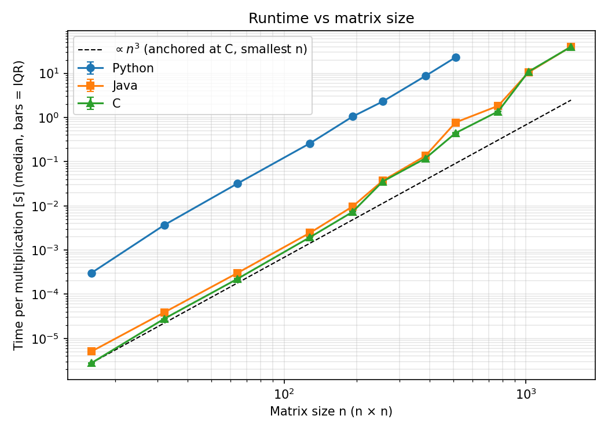
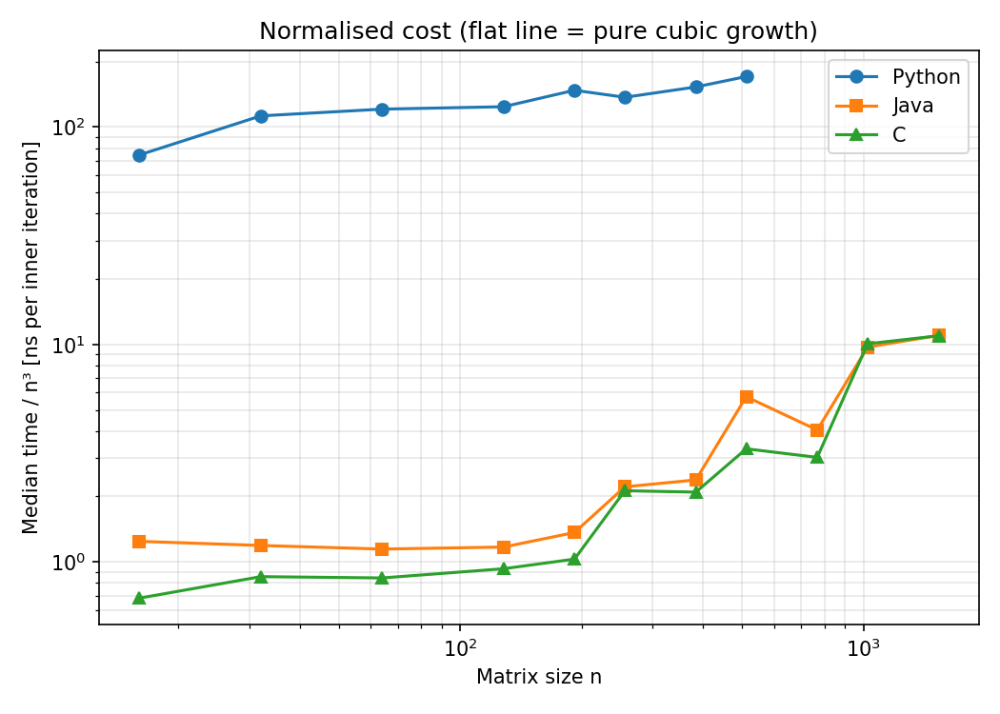
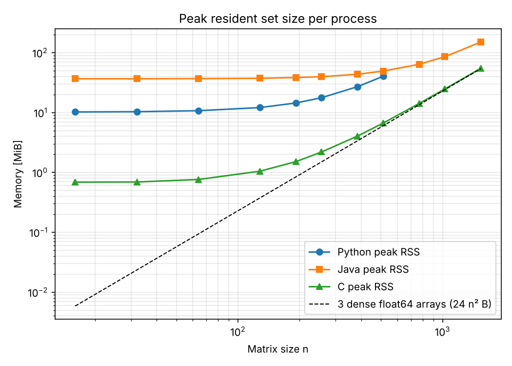
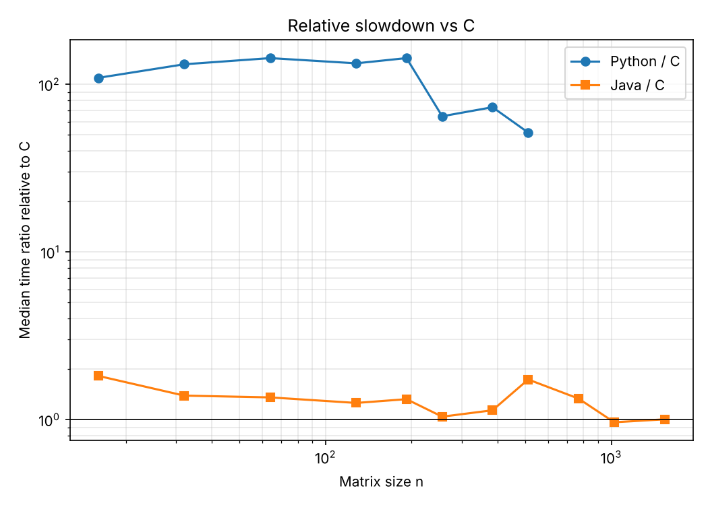

# Abstract

We study how the matrix size *n* affects the runtime and peak memory of the same i-j-k
triple-loop dense matrix multiplication implemented in Python, Java and C. All three
programs read identical float64 inputs, produce bitwise-identical results and are timed with
the same kernel-only boundary on one laptop (Intel Core i5-5350U, 2 cores, 8 GB RAM, macOS).
Within each size regime runtime grows close to the cubic model (fitted exponents 3.0–3.3 for
n ≤ 192), but the cost per inner iteration rises about 16-fold for C (9-fold for Java) between
n = 16 and n = 1536, so a single fit over n ≥ 128 gives exponents near 4.0. Java is 1.3–1.8× slower
than C for small matrices and equal to C (ratio 1.0) for n ≥ 1024, where both appear to be
limited by memory access. CPython is 110–145× slower than C while the data fit in cache and
52–73× slower for n = 256–512. Under a budget of 60 s per repetition, the largest feasible
size was n = 512 for Python and n = 1536 for Java and C. These conclusions apply only to the
tested implementations, settings and machine.

# 1. Introduction and objective

Dense matrix multiplication is a basic kernel of data-science workloads and has a simple
O(n³) algorithm, which makes it a convenient case for studying how language runtimes and the
memory hierarchy affect performance.

**Research question.** How does the matrix size *n* affect the runtime and memory use of
the same basic triple-loop multiplication implemented in Python, Java and C, under the
documented conditions on one machine?

**Hypotheses (stated before running the study).**

* **H1** – Runtime grows approximately as n³ for all three implementations.
* **H2** – C and Java (JIT-compiled to native code) are within a small factor of each other,
  while CPython is one to two orders of magnitude slower.
* **H3** – The time per inner iteration (t/n³) increases once the matrices no longer fit in
  cache, because the inner loop reads B column-wise with a stride of 8n bytes.
* **H4** – Peak memory grows as n², with a larger cost per element for Python (boxed floats)
  and a larger fixed offset for Java (JVM).

# 2. Background

The classical algorithm computes each of the n² output entries as a dot product of length n,
i.e. n³ multiply–add pairs or 2n³ floating-point operations. On real hardware the runtime
also depends on the memory access pattern. In the i-j-k order, A is read along a row (unit
stride) but B is read down a column (stride n elements), which has poor spatial locality and
causes cache and TLB misses once B no longer fits in the caches [1], [2]. High-performance
libraries avoid this with blocking and packing [3]; these optimisations are deliberately
**not** used here and are the subject of Assignment 2.

CPython executes bytecode in an interpreter and represents each float as a separate heap
object, so the cost per arithmetic operation is large. Java bytecode is compiled at run time
by the HotSpot JIT, so warm-up runs must be separated from steady-state measurements [4]. C
is compiled ahead of time.

The rounding error of a length-n dot product in floating point is bounded by γₙ|a|ᵀ|b|, with
γₙ = nu/(1−nu) and u = 2⁻⁵³ [5]. This bound is used for the correctness tolerance.

# 3. Methodology

## 3.1 Implementations

All three programs implement exactly the same loop nest on row-major storage:

```
for i in 0..n-1:
    for j in 0..n-1:
        s = 0.0
        for k in 0..n-1: s += A[i*n+k] * B[k*n+j]
        C[i*n+j] = s
```

| | Python | Java | C |
|---|---|---|---|
| Storage | flat `list` of Python `float` objects (pointers to boxed doubles) | contiguous `double[]` | contiguous `double*` (`malloc`) |
| Toolchain | CPython 3.13.5 (Anaconda) | OpenJDK 21.0.6 (JetBrains Runtime), `javac --release 17` | Apple clang 14.0.0 (invoked as `gcc`) |
| Settings | no NumPy in the kernel; 1 warm-up | `-XX:+UseSerialGC -Xms256m -Xmx4g`; 3 warm-ups | `-O2 -std=c11 -ffp-contract=off`; 1 warm-up |

The unavoidable difference is storage: the Python list stores pointers to separate float
objects instead of contiguous doubles. `-ffp-contract=off` prevents fused multiply–add in C,
so the three programs perform the same IEEE-754 operations in the same order. Java ≥ 17 uses
strict IEEE-754 semantics and does not fuse operations automatically.

## 3.2 Inputs

The inputs are square float64 matrices with entries drawn uniformly from [−1, 1). They are
generated once by `scripts/gen_matrices.py` using Python's `random.Random` (Mersenne
Twister) with the string seed `20262027:n:A` or `20262027:n:B`. They are stored as raw
little-endian binary files that all three languages read, so the logical inputs are
identical. SHA-256 hashes of every file are recorded in `inputs/manifest.csv`.

Declared sizes: n = 16, 32, 64, 128, 192, 256, 384, 512, 768, 1024, 1536, 2048. The list
combines powers of two with intermediate values so that both trends and power-of-two
effects can be seen.

## 3.3 Environment

| Item | Value |
|---|---|
| Machine | MacBook Air (Intel), run on 2026-10-08 |
| CPU | Intel(R) Core(TM) i5-5350U CPU @ 1.80GHz (Broadwell-U, 1.8 GHz base, 2.9 GHz turbo) |
| Cores | 2 physical cores, 4 logical processors |
| Caches [6] | L1d 32 KB and L2 256 KB per core, L3 3 MB shared |
| RAM | 8 GiB |
| OS | macOS, Darwin kernel 21.6.0 (x86_64) |
| Python | CPython 3.13.5 (Anaconda); NumPy 2.1.3 for validation only |
| Java | OpenJDK 21.0.6 (JetBrains Runtime), options `-XX:+UseSerialGC -Xms256m -Xmx4g` |
| C compiler | Apple clang version 14.0.0 (clang-1400.0.29.202), flags `-O2 -std=c11 -ffp-contract=off` |

All kernels are single-threaded. The JVM also runs internal threads (JIT compiler, serial
GC, housekeeping); CPython runs a single thread. The laptop was plugged in and no other
applications were in use. CPU affinity cannot be set on macOS, and the frequency governor is
not exposed, so Turbo Boost was active and is not controlled.

## 3.4 Correctness

`tests/validate.py` runs two groups of checks:

1. **Exact cases** with small integers, which are exactly representable, so the results
   must match exactly: a hand-computed 2×2 product, 1×1, A·I = A, I·B = B, A·0 = 0 and
   random integer matrices up to n = 17.
2. **Random float64 matrices** (n = 2 … 128) compared against NumPy 2.1.3 as a trusted
   reference. A result is accepted when |C − C_ref| ≤ 2γₙ(|A||B|) componentwise.

All 63 checks passed (`results/validation_report.txt`). The largest observed error
was 7.1·10⁻¹⁵ at n = 128, which is 0.7 % of the bound. The three languages produced
bitwise-identical outputs in every random case. During the benchmark, each program printed
a checksum (the sequential sum of C) after every repetition. These checksums were identical
across languages and repetitions for every tested n, which confirms that the computation
was actually executed.

## 3.5 Measurement protocol

* **Timed region.** Only the kernel (the three loops) is timed. Input loading, allocation of
  C, the checksum and output are outside the timed region. C needs no zero-initialisation
  because every entry is written exactly once.
* **Timers.** Monotonic nanosecond timers: `time.perf_counter_ns`, `System.nanoTime` and
  `clock_gettime(CLOCK_MONOTONIC)`.
* **Batches.** For small n, one sample times `max(1, round(2·10⁷/n³))` consecutive
  multiplications (for example 4883 at n = 16 and 1 for n ≥ 256). The batch is the same for
  all languages, and reported times are per multiplication.
* **Repetitions.** One process per (language, n) runs W warm-ups (Python 1, Java 3, C 1)
  followed by 5 measured repetitions. Warm-ups are kept in the raw CSV and excluded from the
  statistics. The order of languages is randomised for each size with a fixed seed, to limit
  bias from drift.
* **Statistics.** Median and interquartile range (IQR) over the 5 repetitions. The empirical
  exponent b is the least-squares slope of log t = a + b log n.
* **Memory.** Peak resident set size (RSS) of the whole process, including the interpreter
  or JVM. On macOS this is `ru_maxrss` of the child process, obtained with `os.wait4`. For
  Java, the used heap after the run is also recorded. The theoretical storage of the three
  arrays is 24n² bytes.
* **Budgets (declared before running).** 60 s per repetition, enforced as a process limit of
  (W + 5)·60 s + 30 s, and 4 GB of memory. After a timeout, larger sizes are not attempted
  for that language.

# 4. Results

All raw data are in `results/run_20261008-202121/`. Tables and figures are generated by
`python3 scripts/analyze.py results/run_20261008-202121`.

**Table 1.** Time per multiplication (median of 5 repetitions), relative spread, cost per
inner iteration (median / n³), throughput, ratio to C and peak RSS.

| Method | n | Median | IQR/median | ns/iter | GFLOP/s | ×C | Peak RSS (MiB) |
|---|--:|--:|--:|--:|--:|--:|--:|
| Python | 16 | 304.8 µs | 4.4 % | 74.41 | 0.027 | 109.3 | 10.2 |
| Python | 32 | 3.69 ms | 1.5 % | 112.56 | 0.018 | 131.7 | 10.3 |
| Python | 64 | 31.69 ms | 3.9 % | 120.88 | 0.017 | 143.4 | 10.7 |
| Python | 128 | 260.10 ms | 1.2 % | 124.02 | 0.016 | 133.5 | 12.1 |
| Python | 192 | 1.04 s | 2.9 % | 147.63 | 0.014 | 143.5 | 14.4 |
| Python | 256 | 2.30 s | 1.5 % | 137.02 | 0.015 | 64.5 | 17.7 |
| Python | 384 | 8.66 s | 0.8 % | 152.89 | 0.013 | 73.1 | 27.1 |
| Python | 512 | 22.92 s | 1.2 % | 170.74 | 0.012 | 51.6 | 40.3 |
| Java | 16 | 5.1 µs | 0.6 % | 1.24 | 1.610 | 1.8 | 36.6 |
| Java | 32 | 39.0 µs | 0.4 % | 1.19 | 1.682 | 1.4 | 36.6 |
| Java | 64 | 300.0 µs | 1.0 % | 1.14 | 1.748 | 1.4 | 36.9 |
| Java | 128 | 2.45 ms | 0.8 % | 1.17 | 1.711 | 1.3 | 37.3 |
| Java | 192 | 9.65 ms | 0.6 % | 1.36 | 1.467 | 1.3 | 38.4 |
| Java | 256 | 37.12 ms | 0.6 % | 2.21 | 0.904 | 1.0 | 39.7 |
| Java | 384 | 134.79 ms | 4.8 % | 2.38 | 0.840 | 1.1 | 43.6 |
| Java | 512 | 771.36 ms | 10.1 % | 5.75 | 0.348 | 1.7 | 49.2 |
| Java | 768 | 1.83 s | 1.4 % | 4.04 | 0.495 | 1.3 | 63.9 |
| Java | 1024 | 10.43 s | 1.6 % | 9.72 | 0.206 | 1.0 | 85.5 |
| Java | 1536 | 39.90 s | 1.1 % | 11.01 | 0.182 | 1.0 | 150.1 |
| C | 16 | 2.8 µs | 5.3 % | 0.68 | 2.938 | 1.0 | 0.7 |
| C | 32 | 28.0 µs | 2.6 % | 0.85 | 2.341 | 1.0 | 0.7 |
| C | 64 | 220.9 µs | 4.6 % | 0.84 | 2.373 | 1.0 | 0.8 |
| C | 128 | 1.95 ms | 9.9 % | 0.93 | 2.152 | 1.0 | 1.0 |
| C | 192 | 7.28 ms | 3.4 % | 1.03 | 1.943 | 1.0 | 1.5 |
| C | 256 | 35.63 ms | 1.2 % | 2.12 | 0.942 | 1.0 | 2.2 |
| C | 384 | 118.47 ms | 12.7 % | 2.09 | 0.956 | 1.0 | 4.1 |
| C | 512 | 444.32 ms | 7.5 % | 3.31 | 0.604 | 1.0 | 6.7 |
| C | 768 | 1.37 s | 0.6 % | 3.02 | 0.662 | 1.0 | 14.2 |
| C | 1024 | 10.81 s | 4.4 % | 10.07 | 0.199 | 1.0 | 24.7 |
| C | 1536 | 39.72 s | 0.7 % | 10.96 | 0.182 | 1.0 | 54.7 |

**Table 2.** Empirical growth exponent b from a log–log least-squares fit, over the
predefined range n ≥ 128 and piecewise over three size regimes.

| Method | n ≥ 128 | n 16–192 | n 256–768 | n 1024–1536 |
|---|--:|--:|--:|--:|
| Python | 3.20 | 3.23 | 3.31 (n ≤ 512) | – |
| Java | 3.95 | 3.02 | 3.71  | 3.31 |
| C | 4.02 | 3.14 | 3.40  | 3.21 |

**Table 3.** Largest feasible size under the declared budgets and the failures observed.

| Method | Largest feasible n | Largest attempted n | Failures |
|---|---|---|---|
| Python | 512 | 768 | n=768: timeout (limit 390 s) |
| Java | 1536 | 2048 | n=2048: timeout (limit 510 s) |
| C | 1536 | 2048 | n=2048: timeout (limit 390 s) |

**Table 3b.** Repetitions completed before the process limit was reached. They exceed the declared 60 s per-repetition budget and are excluded from all statistics.

| Method | n | warm-ups done | measured reps done | time per completed rep [s] |
|---|---|---|---|---|
| C | 2048 | 1 | 2 | 104.2, 104.1 |
| Java | 2048 | 3 | 2 | 99.3, 98.2 |
| Python | 768 | 1 | 3 | 79.3, 79.9, 78.4 |

**Table 4.** Effect of JIT warm-up in Java: first and last warm-up run divided by the median
of the measured repetitions.

| Method | n | first warm-up / median | last warm-up / median |
|---|---|---|---|
| Java | 16 | 1.80 | 1.00 |
| Java | 32 | 1.82 | 1.01 |
| Java | 64 | 1.95 | 1.00 |
| Java | 128 | 1.63 | 0.99 |
| Java | 192 | 1.38 | 0.92 |
| Java | 256 | 1.44 | 1.03 |
| Java | 384 | 1.17 | 0.96 |
| Java | 512 | 0.84 | 1.11 |
| Java | 768 | 0.99 | 1.02 |
| Java | 1024 | 1.24 | 1.00 |
| Java | 1536 | 1.00 | 1.00 |

{width=80%}

{width=80%}

{width=80%}

{width=80%}

# 5. Discussion

**Growth with n (H1, partly supported).** Inside each regime the growth is close to cubic:
for n ≤ 192 the fitted exponents are 3.02 (Java), 3.14 (C) and 3.23 (Python). Over the
predefined range n ≥ 128, however, C and Java give b ≈ 4.0. This does not mean the algorithm
changed. The arithmetic work is exactly n³, but the cost of each inner iteration is not
constant (Fig. 2): for C it rises from 0.68–1.03 ns (n ≤ 192) to about 2.1 ns (n = 256–384),
3.0–3.3 ns (n = 512–768) and 10–11 ns (n = 1024–1536). The cubic model therefore describes
the operation count, while the constant in front of n³ depends on where the data live in the
memory hierarchy.

**Memory hierarchy (H3, supported, mechanism partly hypothetical).** The steps in Fig. 2
match the column-wise access to B. The step between n = 192 and n = 256 occurs where B
(8n² bytes: 288 KiB → 512 KiB) outgrows the 256 KB per-core L2 cache [6]. The largest step,
at n = 1024, occurs where even B alone (8 MiB) is far larger than the 3 MB L3 cache, so most
accesses go to DRAM. Two observations suggest more than simple capacity effects:

* n = 512 is more expensive per iteration than the larger n = 768, in both C (3.31 vs 3.02 ns)
  and Java (5.75 vs 4.04 ns). With n = 512 the column stride is exactly 4096 bytes, and
  power-of-two strides are known to map many accesses onto the same cache sets, which causes
  conflict misses [2].
* At n ≥ 512 every step down a column touches a new 4 KiB page, so TLB misses are also
  likely.

Without hardware performance counters we cannot separate these causes. They are plausible
explanations consistent with the data, not measured facts.

**Java versus C (H2, supported).** After warm-up, Java is 1.3–1.8× slower than C for
n ≤ 192 and 1.0–1.3× of C for n = 256–768 (1.7× at n = 512). Java takes the same time as C (ratio 1.0) at
n = 1024 and 1536, where both reach about 0.18–0.21 GFLOP/s. The convergence is consistent
with a memory-bound kernel: once most time is spent waiting for B, differences in generated
code matter little. The small-n gap may come from differences in the generated machine code,
such as array bounds checks; we did not inspect the JIT output. Table 4 shows why warm-up
matters: the first Java warm-up at small n took 1.4–1.95× longer than the steady state,
while the third was within a few percent of it. The Java result at n = 512 is an outlier
(ratio 1.7, IQR/median 10 %, warm-ups getting slower). We do not have evidence to explain it.

**Python (H2, supported).** CPython costs 74–171 ns per inner iteration, against about 1 ns
for C in cache. This makes it 110–145× slower than C for n ≤ 192 and 52–73× slower for
n = 256–512. The ratio falls because C slows down sharply once it becomes memory-bound,
while Python's per-iteration cost is dominated by bytecode interpretation and object
handling and grows much less (2.3× between n = 16 and 512, against 4.9× for C over the
same range). Python's own exponent over n = 128–512 is 3.20.

**Memory (H4, supported).** C's peak RSS is almost exactly the array storage: 54.7 MiB at
n = 1536 against 54.0 MiB for three float64 arrays. Java adds a fixed offset of about 36 MiB
for the JVM, and at n = 1536 it uses about 17 bytes per matrix element. The extra bytes are
plausibly the input buffers kept until garbage collection, since used heap was 79 MB at the
end of the run. Python starts at about 10 MiB and needs about 40 bytes per element at
n = 512 (40.3 MiB in total). This is consistent with an 8-byte list pointer plus a 24-byte
float object per element, plus temporary buffers used while loading. Memory was never the
limiting factor: the largest process used 241 MB, far below the 4 GB budget.

**Limits.** The per-repetition budget, not memory, determined the largest feasible size.
Python at n = 768 needed about 79 s per repetition and C and Java at n = 2048 about 98–104 s
(Table 3). These partial repetitions are reported but not used in any statistic. Following
the cubic trend, one Python repetition at n = 1536 would take 10 minutes or more; this is an extrapolation,
not a measurement.

**Variability and validity.** IQR/median was below 5 % in 25 of 30 configurations, with a
maximum of 12.7 % (C, n = 384). No observations were removed. The main threats to validity
are:

* a single laptop with Turbo Boost and thermal behaviour not controlled, and no CPU pinning
  on macOS;
* one process per configuration, so variation between process launches is not captured;
* the memory metric includes the runtime and is not identical across languages;
* the sizes are coarse, so the exact position of each step is not resolved.

The results do not show that one language is faster in general. They describe these three
straightforward implementations on this machine.

# 6. Conclusions

* For the tested i-j-k implementations, runtime follows the n³ operation count only within
  each size regime. The cost per inner iteration grows about 16-fold for C and 9-fold for Java between
  small matrices and n ≥ 1024, so the effective exponent over n = 128–1536 is close to 4.
* C and Java behave alike: Java is 1.3–1.8× slower while data are in cache and equal to C
  for large matrices. CPython is roughly 50–145× slower than C, depending on n.
* Memory grows as n² in all three, with about 8, 17 and 40 bytes per element for C, Java
  and Python respectively, and was never the binding constraint.

The development of the study was also shaped by the machine itself. My personal laptop is
fairly old: a 2015-generation, 15 W dual-core processor with a 3 MB last-level cache and
8 GB of DDR3 memory. It struggles with the dense, long-running executions this experiment
requires. A single repetition took about 40 s for C and Java at n = 1536 and about 23 s for
Python at n = 512. The full study took about 40 minutes, and the larger sizes (Python at
n = 768, C and Java at n = 2048) exceeded the 60 s budget per repetition. The small caches
also explain why the cost per iteration increases already at moderate sizes. On a more
recent computer the absolute times would be lower and larger sizes would be feasible, so the
absolute values and the size limits reported here are specific to this laptop. The relative
behaviour (cubic operation count, increasing memory cost, Java converging to C, and the
interpretation overhead of Python) is what this study supports, and confirming it on other
hardware remains open. In conclusion with better conditions it will be better for the user to save time and find the solution in the best way possible. 

Next:

* how much of the large-n cost comes from cache conflicts, cache capacity and TLB misses;
  this could be tested with hardware counters, or with the unit-stride i-k-j order and
  blocking (Assignment 2);
* how the kernel scales across threads (Assignment 3).

# Use of generative AI

I used Claude (Anthropic) throughout this assignment: to help with the design of the
experiment, to explain the topic so I could learn it, to help me develop the code (it
generated the first versions of the three implementations and of the benchmarking and
analysis scripts), and to draft the report from my results. I ran all the experiments on my
own computer, fixed the problems that came up when running them on macOS, and reviewed the
code and the text. Every number here comes from those runs, and I can explain and defend
the conclusions.

# References

[1] J. L. Hennessy and D. A. Patterson, *Computer Architecture: A Quantitative Approach*, 6th ed. Cambridge, MA, USA: Morgan Kaufmann, 2017.

[2] U. Drepper, "What every programmer should know about memory," Red Hat, Inc., Tech. Rep., 2007.

[3] K. Goto and R. A. van de Geijn, "Anatomy of high-performance matrix multiplication," *ACM Trans. Math. Softw.*, vol. 34, no. 3, Art. 12, 2008.

[4] A. Georges, D. Buytaert, and L. Eeckhout, "Statistically rigorous Java performance evaluation," in *Proc. OOPSLA*, 2007, pp. 57–76.

[5] N. J. Higham, *Accuracy and Stability of Numerical Algorithms*, 2nd ed. Philadelphia, PA, USA: SIAM, 2002.

[6] TechPowerUp, "Intel Core i5-5350U," CPU Database. [Online]. Available: https://www.techpowerup.com/cpu-specs/core-i5-5350u.c1812

**Reproducibility materials.** GitHub repository https://github.com/amaisuarez/assignment1. The
study was run from commit `ffcf45a`; raw data in `results/run_20261008-202121/`.
